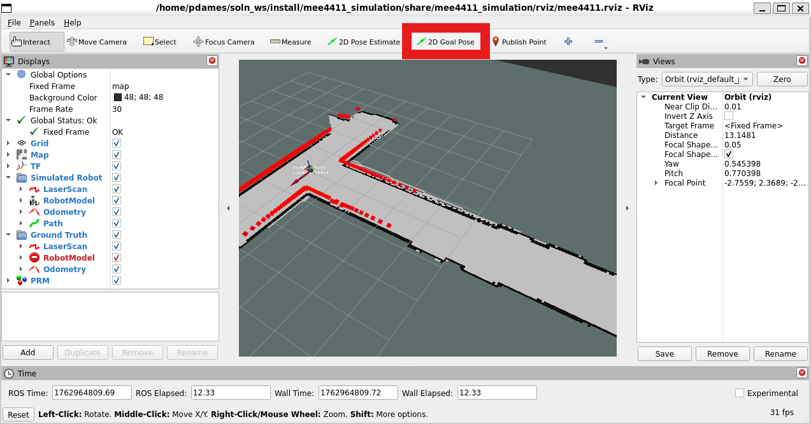

# Overview

This package contains a global path planning system that uses a Probabilistic Roadmap (PRM) algorithm to plan collision-free paths through an occupancy grid map. The system creates a costmap from the input map by inflating obstacles according to the robot's size, then builds a PRM graph for efficient path planning. The package provides action servers for path planning that are compatible with ROS2 Navigation2 (nav2) framework.

# Learning objectives

1. Implement and test a Probabilistic Roadmap (PRM) algorithm for sampling-based path planning.
2. Understand costmap generation from occupancy grids, including obstacle inflation based on robot footprint.
3. Integrate path planning algorithms with ROS2 action servers and Navigation2 framework.
4. Work with graph data structures and spatial search algorithms (A*) for path finding.

# Pre-Requisites
You need to have completed the `MapConversions` and `OccupancyGridMap` classes from the [occupancy grid map](../occupancy_grid/README.md) module.

# Dependencies

This package requires several additional Python modules:

```bash
pip3 install networkx tqdm
pip3 install --upgrade opencv-python
pip3 install scipy -U
```

Additionally, Navigation2 packages are required:

```bash
sudo apt install ros-humble-navigation2 ros-humble-nav2-bringup
```

Standard ROS2 packages are also required at runtime (rclpy, tf2_ros, nav_msgs, geometry_msgs, visualization_msgs).

# File Layout

This directory contains the following files and folders:

- [`package.xml`](package.xml): ROS 2 package manifest with dependencies and metadata.
- [`pytest.ini`](pytest.ini): Pytest configuration file.
- [`setup.cfg`](setup.cfg): Configuration for Python packaging and linting.
- [`setup.py`](setup.py): Python setup script for installing the package.
- [`README.md`](README.md): This file.
- [`resource/global_planning`](resource/global_planning): Resource file for ROS 2 package index.
- [`test/`](test) - basic package tests (flake8, pep257, copyright)

## [`costmap2d`](costmap2d) Python Package

This package provides a costmap generation system that creates navigation-ready costmaps from occupancy grid maps.

- [`costmap2d/__init__.py`](costmap2d/__init__.py): Initializes the `costmap2d` Python package.
- [`costmap2d/costmap_2d.py`](costmap2d/costmap_2d.py): Costmap generation node implementation (class `Costmap2D`). Converts occupancy grids to costmaps with obstacle inflation based on robot footprint.

## [`prm`](prm) Python Package

This package provides the core PRM algorithm implementation and ROS2 node for path planning.

- [`prm/__init__.py`](prm/__init__.py): Initializes the `prm` Python package.
- [`prm/prm.py`](prm/prm.py): PRM algorithm implementation (class `PRM`). Contains methods for graph construction, collision checking, and path planning.
- [`prm/prm_node.py`](prm/prm_node.py): ROS2 lifecycle node that provides action servers for path planning using the PRM algorithm.

## [Launch file](../mee4411_simulation/launch/navigation_launch.py)

There is a new launch file to bring up the navigation nodes. You do not need to do anything to this file, but you may want to look through it to see what the new nodes all are. This file is included in the standard [`simulation.xml`](../mee4411_simulation/launch/simulation.xml#L84-L90) file.

## New ROS2 Concepts

This package uses two new ROS2 concepts relative to the other assignments.

### Actions

The planner uses an action server to handle requests. You can read more about the [general concept](https://docs.ros.org/en/humble/Concepts/Basic/About-Actions.html) of actions in ROS2 and do a short [Python tutorial](https://docs.ros.org/en/humble/Tutorials/Intermediate/Writing-an-Action-Server-Client/Py.html). These are between a topic (which is just one way communication) and a service (two way communication, non-interruptable). An action has two way communication but is interruptable. 

There are three pieces to an action:
1. Request: sent from the client to the server
2. Feedback: (optionally) sent from the server back to the client to update the client on progress
3. Response: sent from the server back to the client once the process is completed.

### Lifecycle Nodes

The planner and costmap nodes are both `LifecycleNode`s. You can read more about the general concept [here](https://github.com/ros2/demos/blob/humble/lifecycle/README.rst) and [here](https://design.ros2.org/articles/node_lifecycle.html). The main idea of a `LifecycleNode` is to allow for nodes to be brought up in a specific order. This is useful to ensure that everything comes up in the right order, for example you cannot plan a path through a map until you have a map ready. The Navigation2 packages uses `LifecycleNode`s extensively.

# Instructions

Your task is to implement functions to perform PRM-based path planning and integrate it with ROS2 Navigation2 framework.

## [`prm.py`](prm/prm.py)

This file implements the `PRM` class, which provides the core probabilistic roadmap functionality.

### [`sample_free_point`](prm/prm.py#L145-L164)
This method draws random points from within the free space of the map. *You must implement this.*

The method should:
- Draw random points within the map boundaries
- Check if points are in free space (i.e., not in collision)
- Return valid points as numpy arrays

### [`valid_edge`](prm/prm.py#L166-L184)
This method checks if an edge connecting two points is collision-free. *You must implement this.*

The method should:
- Create intermediate points along the edge using `self.step_size`
- Check each intermediate point for collisions with the map
- Return `True` if the entire edge is valid

Feel free to use a different method, such as solving the geometric problem to check for collisions along the line.

### [`add_to_prm`](prm/prm.py#L92-L143)
This method adds points to the PRM graph and connects them. *You must implement this.*

The method should:
- Generate valid free space points using `sample_free_point`
- Add points to the NetworkX graph with 'location' attributes
- Build a KDTree for efficient nearest neighbor queries
- Connect points within `connection_radius` if edges are valid

### [`query`](prm/prm.py#L186-L216)
This method queries the PRM to find a path from start to goal. *You must implement this.*

The method should:
- Add start and goal points to the graph temporarily
- Connect them to nearby nodes
- Use NetworkX A* algorithm to find the shortest path
- Convert the path to a `nav_msgs/msg/Path` message

## [`prm_node.py`](prm/prm_node.py)

This file implements the `PRMNode` class, which provides ROS2 action servers for path planning.

### [`path_to_pose_callback`](prm/prm_node.py#L162-L184)
This method handles action requests for planning paths to a single goal pose. *You must implement this.*

The callback should:
- Extract the goal pose from the action request
- Get the current robot position from transforms
- Use `prm.query` to plan a path
- Fill in the action result with the planned path and timing information

### [`path_through_poses_callback`](prm/prm_node.py#L186-L212)
This method handles action requests for planning paths through multiple waypoints. *Only students in MEE 5411 must implement this.*

The callback should:
- Extract multiple goal poses from the action request
- Validate the input data
- Plan paths sequentially through all waypoints
- Combine individual path segments into a single path
- Fill in the action result

## [`costmap_2d.py`](costmap2d/costmap_2d.py)

This file implements the `Costmap2D` class, which generates costmaps from occupancy grids. The key method is:

### [`map_callback`](costmap2d/costmap_2d.py#L162-L217)
This method converts an occupancy grid to a costmap by binarizing the map and inflating obstacles according to the robot's footprint. The implementation is provided but you should understand how it works.

# Testing

This package includes only basic automated style tests. Run them from the workspace root after building with colcon:

```bash
# from workspace root
colcon build --packages-select global_planning
source install/setup.bash
colcon test --packages-select global_planning
colcon test-result --verbose
```

Unit tests provided by ROS in `test/` are primarily style and metadata checks (flake8, pep257).

# How to run the node (quick guide)

1. Build and source your workspace:

```bash
colcon build
source install/setup.bash
```

2. Add your node to the [launch file](../mee4411_simulation/launch/simulation.xml) under the `<!-- Global planning -->` heading. Note, there is a new argument to the launch file called `use_nav2_planner` with the intended behavior of launching *your* planner node if it is set to `false` and using the built in navigation 2 planner node if it is set to `true` (hint: look at the `if` and `unless` tags for a node in the [launch file description](https://design.ros2.org/articles/roslaunch_xml.html)).

3. Test path planning with Navigation2:

```bash
ros2 launch mee4411_simulation simulation.xml
```

4. Send a goal to the robot using the tool in `rviz`



Once you send a goal, you should see a path appear and the robot will follow it:


# Suggested development & debugging order

1. Implement and unit-test `PRM.sample_free_point` with simple maps to ensure points are generated in free space.
2. Implement `PRM.valid_edge` with collision checking along line segments.
3. Implement `PRM.add_to_prm` to build the graph structure with proper connectivity.
4. Test the complete PRM construction with visualization in rviz.
5. Implement `PRM.query` for path planning between two points.
6. Implement `PRMNode.path_to_pose_callback` for single goal planning.
7. Implement `PRMNode.path_through_poses_callback` for multi-waypoint planning.
8. Test integration with Navigation2 framework.

# Edge cases and tests to run manually

- Test with maps containing narrow passages to ensure PRM can find valid paths.
- Verify the system handles unreachable goals gracefully.
- Test with different PRM parameters (number of points, connection radius) to understand trade-offs.
- Ensure costmap inflation properly accounts for robot size and shape.
- Test path planning with various robot footprints (burger, waffle, waffle_pi).
- Verify the system works with dynamic reconfiguration of PRM parameters.

# Action Server Interfaces

The package provides two action servers compatible with Navigation2:

- `/compute_path_to_pose` (nav2_msgs/action/ComputePathToPose): Plans a path to a single goal pose.
- `/compute_path_through_poses` (nav2_msgs/action/ComputePathThroughPoses): Plans a path through multiple waypoints.

# Parameters

Key parameters for the PRM node:

- `num_points`: Number of points to sample in the PRM (default: 1000)
- `connection_radius`: Radius for connecting nodes in the graph (default: 1.0)
- `step_size`: Step size for collision checking along edges (default: 0.01)
- `robot_frame`: Frame ID for the robot base (default: 'base_footprint')
- `show_prm`: Whether to publish visualization markers (default: true)

# Contributing

If you add tests, please place them under the `test/` directory and update `pytest.ini` if needed. Keep style consistent with the rest of the repository (PEP8 and PEP257).
